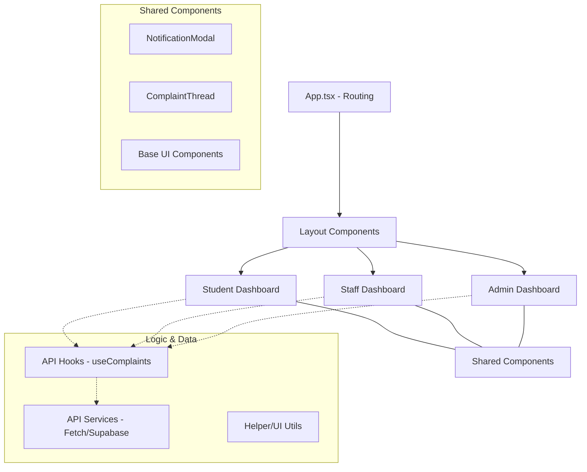

# 🚀 ASTU Smart Complaint & Issue Tracking - Frontend

[](https://vitejs.dev/)
[](https://reactjs.org/)
[](https://www.typescriptlang.org/)
[](https://tailwindcss.com/)
[](https://www.framer.com/motion/)

A high-performance, premium user interface for the ASTU Smart Complaint & Issue Tracking system. Built with modern web technologies, it provides a seamless experience for students, staff, and administrators to manage academic and campus issues.

---

## 🏗 Architecture Overview

The frontend follows a **Modular Component-Based Architecture** focused on reusability, type safety, and clear separation of concerns.



---

## ✨ Features by Role

### 🎓 Student Portal

- **Dashboard**: Overview of individual complaint statuses and quick actions.
- **Complaint Submission**: Sleek forms for reporting issues with category selection.
- **Real-time Chat**: Direct communication line with assigned staff members.
- **Knowledge Base**: Curated resources for common campus issues.
- **Smart Notifications**: Instant alerts when status changes or new messages arrive.

### 💼 Staff Portal

- **Ticket Management**: Sortable, filterable lists of assigned tasks.
- **SLA Tracking**: Visual countdowns for Service Level Agreement deadlines.
- **Resolution Workflow**: Quick "Mark as Resolved" actions with automated student notification.
- **Student History**: Deep-link access to a student's previous complaint records (secured via UUID mapping).

### 🛡 Admin Dashboard

- **User Management**: Creating, updating, and disabling user accounts across roles.
- **Department Controls**: Managing departmental assignments and task loads.
- **Global Overview**: Monitoring all system activities and reports.

---

## 🛠 Tech Stack

| Technology        | Purpose                                                        |
| :---------------- | :------------------------------------------------------------- |
| **Vite**          | Lightning-fast build tool and dev server.                      |
| **React 19**      | Component-based UI library for dynamic state management.       |
| **TypeScript**    | Static typing for robust code and better developer experience. |
| **Tailwind CSS**  | Utility-first CSS framework for premium, responsive design.    |
| **Framer Motion** | Physics-based animations for a premium "app-like" feel.        |
| **Lucide React**  | Beautiful, consistent icon set.                                |
| **Date-fns**      | Modular date manipulation and formatting.                      |

---

## 📂 Folder Structure

```text
src/
├── api/          # Service layer for backend communication
├── components/   # Reusable UI components
│   ├── shared/   # Components used across all roles (e.g., Chat Threads)
│   ├── staff/    # Staff-specific dashboard elements
│   ├── admin/    # Admin-specific management tools
│   └── layout/   # Persistent wrappers (Sidebar, Header)
├── hooks/        # Custom React hooks (Data fetching/Cache)
├── lib/          # External library configurations
├── pages/        # High-level page components (Route entry points)
└── styles/       # Global CSS and Design Tokens
```

---

## 🚀 Getting Started

### Prerequisites

- [Node.js](https://nodejs.org/) (v18+)
- [npm](https://www.npmjs.com/) or [yarn](https://yarnpkg.com/)

### Installation

1. **Clone the repository** (if not already done).
2. **Navigate to the frontend folder**:
   ```bash
   cd Frontend
   ```
3. **Install dependencies**:
   ```bash
   npm install
   ```
4. **Environment Variables**:
   Create a `.env` file in the root directory:
   ```env
   VITE_API_URL=http://localhost:8000/api/v1
   ```
5. **Run Development Server**:
   ```bash
   npm run dev
   ```

---

## 💎 Design System

The application uses a **Glassmorphism & Vibrant** design system:

- **Primary Color**: Modern Blue for professional focus.
- **Accents**: Subtle gradients for premium depth.
- **Micro-interactions**: Every button and card uses smooth hover and entrance animations.
- **Typography**: Inter / System sans-serif for maximum readability.

---

## 📝 Recent Updates

- ✅ **Notification System**: Integrated real-time bell notifications for all roles.
- ✅ **UUID Routing**: Fixed "Not Found" errors by migrating navigation to internal UUIDs.
- ✅ **Staff Actions**: Implemented "Mark as Resolved" with resolution timestamps.
- ✅ **Auto-Scroll Fix**: Refined chat behavior to prevent jumpy page loads.

---

_Created for the ASTU STEM Project._
